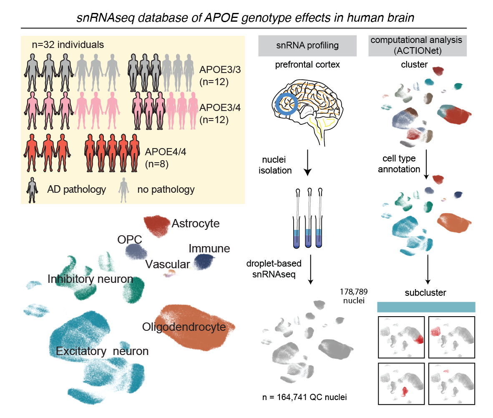

| :exclamation:  We are experiencing some administrative delays in making the human post-mortem single cell data available on Synapse [syn38120890]. We are working on it and the data will be available ASAP.|
|-----------------------------------------|

***This repository contains instructions for open data access and code to reproduce the analyses presented in***
# APOE4 impairs myelination via cholesterol dysregulation in oligodendrocytes

- [Paper](https://www.nature.com/articles/s41586-022-05439-w)
- [Associated podcast](https://www.nature.com/articles/d41586-022-03746-w)
- [Nature News](https://www.nature.com/articles/d41586-022-03724-2)
- [News and Views](https://www.nature.com/articles/d41586-022-03371-7)

### snRNAseq & lipidomic Data availability
<p align="center">
  
</p>

- If you would like to process the `raw counts matrix and associated metadata`, these files can be downloaded from the AD Knowledge Portal under Synapse ID [syn38120890](https://www.synapse.org/#!Synapse:syn38120890/datasets/). If you would like access to the FASTq files, please contact us: djuna@mit.edu; Subject: `apoe4myelin fastq request`. *N.B. Data is currently being uploaded and a specific link will be posted soon* 
- If you would like to access the `fully-processed, annotated, and qc-ed data`, that data can be found [here](https://www.synapse.org/#!Synapse:syn38120890/datasets/). *N.B. Data is currently being uploaded and a specific link will be posted soon* 
- If you would like to access the `annotated pre-qc lipidomic data`, that data can be found [here](https://www.synapse.org/#!Synapse:syn38120890/datasets/). *N.B. Data is currently being uploaded and a specific link will be posted soon* 

### other Data availability
- All other datasets needed for this analysis are available through [the open science framework](https://osf.io/uyczk/).
- each file is described in detail [below](#3c-if-youd-like-to-recapitulate-any-of-the-analyses-presented-in-the-paper)

### Reproduce analyses and plots
Follow these instructions to reproduce analyses and plots, as shown in the paper.

##### 1. Download the repository by running:

```bash
git clone https://github.com/djunamay/apoe4myelin.git
```

##### 2. Create the conda environments and install dependencies:

To create the first conda environment, run this in your terminal:
```bash
conda env create -f ./environment/apoe_env.yml
conda activate apoe4myelin_env
R
```
In your R console, run:
```R
install.packages("BiocManager")
BiocManager::install(version=“3.14”)
BiocManager::install("ComplexHeatmap", version="3.14") # preferred package version = 2.10.0
BiocManager::install("BiocParallel", version="3.14") # preferred package version = 1.28.3
BiocManager::install("SingleCellExperiment", version="3.14") # preferred package version = 1.16.0
BiocManager::install("limma", version="3.14") # preferred package version = 3.50.3
BiocManager::install("GSVA", version="3.14") # preferred package version = 1.42.0
BiocManager::install("edgeR", version="3.14") # preferred package version = 3.36.0
BiocManager::install("fgsea", version="3.14") # preferred package version = 1.20.0
```
Create the second custom conda environment by running:
```bash
conda create -n actionet_legacy_env  -c conda-forge r-devtools
```
Install the ACTIONet package (legacy version) from github by running the following:
```bash
conda activate actionet_legacy_env
R
```
In your R console, run this:
```R
library(devtools)
devtools::install_github("shmohammadi86/ACTIONet_legacy")
install.packages("harmony")
install.packages("R.utils")
install.packages("BiocManager")
BiocManager::install("BiocParallel")
install.packages("ggpubr")
BiocManager::install("scran")
BiocManager::install("scater")
```
##### 3a. If you'd like to perform your own QC and celltype annotation from scratch
1. Download the raw counts matrix and associated metadata from Synapse [here](https://www.synapse.org/#!Synapse:syn38120890/datasets/).
Please note, a data-use agreement must be submitted to access these data. Follow instructions on Synapse [here](https://www.synapse.org/#!RegisterAccount:0).

##### 3b. If you'd like to recapitulate our QC and celltype annotation
1. create `actionet_legacy_env` conda environment as described in point `2`
2. Follow instructions from point `3c.5` to access and download the `/single_cell_data` files marked by `*`. Download the `raw_counts_data` folder from Synapse, as described in point `3a.1`.
3. Navigate to the scripts folder, Now run:
```bash
conda activate actionet_legacy_env
Rscript ../scripts/generate_raw_sce_object.r 
Rscript ../scripts/qc_and_annotation.r 
```

##### 3c. If you'd like to recapitulate any of the analyses presented in the paper
1. create `apoe4myelin_env` conda environment as described in point `2`
2. follow instructions [here](https://github.com/lhe17/nebula) to download the nebula package into the `apoe4myelin_env` environment
3. follow instructions [here](https://github.com/immunogenomics/presto) to download the immunogenomics/presto package into the `apoe4myelin_env` environment
4. Create the following /plots directory within this git repo
```
apoe4myelin
└───plots
    └───Extended_1
    └───Extended_2
    └───Extended_3
    └───Extended_5
    └───Extended_7
    └───Extended_8
    └───Figure_1
    └───Figure_2
    └───Figure_4
    └──qc_annotation
```
5. download necessary [data](https://osf.io/uyczk/) from OSF into a directory named /data within this git repo. This directory includes the following files:

| Data File                                                     | Description / Origin                                                                                                                                                                                                    |       
|---------------------------------------------------------------|-------------------------------------------------------------------------------------------------------------------------------------------------------------------------------------------------------------------------|
| pathway_databases/GO_Biological_Process_2018.txt              | from mayaan lab  [here](https://maayanlab.cloud/Enrichr/#libraries)                                                                                                                                                     |
| pathway_databases/HumanCyc_2016.txt                           | from mayaan lab [here](https://maayanlab.cloud/Enrichr/#libraries)                                                                                                                                                      |
| pathway_databases/KEGG_2019_Human.txt                         | from mayaan lab [here](https://maayanlab.cloud/Enrichr/#libraries)                                                                                                                                                      |
| pathway_databases/Reactome_2016.txt                           | from mayaan lab [here](https://maayanlab.cloud/Enrichr/#libraries)                                                                                                                                                      |
| iPSC_data/FPKM_table_AST.txt                                  | FPKM normalized counts from GEO accession number: [GSE102956](https://www.ncbi.nlm.nih.gov/geo/query/acc.cgi?acc=GSE102956)                                                                                             |
| iPSC_data/FPKM_table_MIC.txt                                  | FPKM normalized counts from GEO accession number: [GSE102956](https://www.ncbi.nlm.nih.gov/geo/query/acc.cgi?acc=GSE102956)                                                                                             |
| iPSC_data/FPKM_table_NEU.txt                                  | FPKM normalized counts from GEO accession number: [GSE102956](https://www.ncbi.nlm.nih.gov/geo/query/acc.cgi?acc=GSE102956)                                                                                             |
| iPSC_data/FPKM_table_OPC.txt                                  | see methods section "Bulk RNA-sequencing from isogenic iPSC-derived oligodendroglia" in our paper; run ../scripts/get_opc_ipsc_counts_table.r                                                                           |
| iPSC_data/opc_ipsc_bulk_rnaseq_count_files/                   | see methods section "Bulk RNA-sequencing from isogenic iPSC-derived oligodendroglia" in our paper                                                                                                                       |                                                                                                                           |
| single_cell_data/Cell_group_colors.rds `*`                        | colors assigned manually                                                                                                                                                                                                |
| single_cell_data/expressed_genes_per_celltype.rds             | run ./scripts/get_expressed_genes_per_celltype.r                                                                                                                                                                        |
| single_cell_data/Mapping.rds `*`                                  | colors assigned manually                                                                                                                                                                                                |
| single_cell_data/RefCellTypeMarkers.adultBrain.rds `*`           | Reference cell type marker genes were obtained from PsychENCODE, reported in Wang, D. et al. Comprehensive functional genomic resource and integrative model for the human brain. Science 362, (2018)                   |
| single_cell_data/PanglaoDB.by.organ.by.celltype.rds  `*`         | downloaded from Panglao database (https://panglaodb.se/); Franzén, O., Gan, L.-M. & Björkegren, J. L. M. PanglaoDB: a web server for exploration of mouse and human single-cell RNA sequencing data. Database  2019, (2019). |                                                                                                                                                                                                       |
| differentially_expressed_genes/E4_nebula_associations_Oli.rds | run ./scripts/nebula_degs.r                                                                                                                                                                                             |
| differentially_expressed_genes/oli_wilcox_results.rds         | run ./scripts/get_wilcox_degs.r                                                                                                                                                                                         |
| differentially_expressed_genes/oli_wilcox_results_AD.rds      | run ./scripts/get_wilcox_degs.r                                                                                                                                                                                         |
| differentially_expressed_genes/oli_wilcox_results_noAD.rds    | run ./scripts/get_wilcox_degs.r                                                                                                                                                                                         |
| differentially_expressed_genes/OPC_deg_statistics.txt         | see methods section "Bulk RNA-sequencing from isogenic iPSC-derived oligodendroglia" in our paper                                                                                                                       |
| single_cell_data/ensembl.GRCh38p12.genes.complete.annot.rds    | |
| supplementary_tables/   `*`  | pathway renaming and selection for figure 1 (manual)|

6. Download the single-cell- and lipidomic-related data from [Synapse](https://www.synapse.org/#!Synapse:syn38120890/datasets/) and add these data to the ./data directory according to the directories given in the table below. The file ROSMAP_clinical.csv needs to be downloaded separately [from here](https://www.synapse.org/#!Synapse:syn3191087.11). Files marked with `*` must be downloaded from Synapse for this step. Some files can also be generated, as described in the `Description/Origin` column.

| Data File                                                       | Description / Origin                                                                                                                            |       
|-----------------------------------------------------------------|-------------------------------------------------------------------------------------------------------------------------------------------------|
| single_cell_data/individual_level_averages_per_celltype/Ast.csv | run ./scripts/get_individual_level_averages_object.r                                                                                            |
| single_cell_data/individual_level_averages_per_celltype/Ex.csv  | run ./scripts/get_individual_level_averages_object.r                                                                                            |
| single_cell_data/individual_level_averages_per_celltype/In.csv  | run ./scripts/get_individual_level_averages_object.r                                                                                            |
| single_cell_data/individual_level_averages_per_celltype/Mic.csv | run ./scripts/get_individual_level_averages_object.r                                                                                            |
| single_cell_data/individual_level_averages_per_celltype/Oli.csv | run ./scripts/get_individual_level_averages_object.r                                                                                            |
| single_cell_data/individual_level_averages_per_celltype/Opc.csv | run ./scripts/get_individual_level_averages_object.r                                                                                            |
| single_cell_data/qc_counts_data/qc_column_metadata.csv `*` | collected and shared by ROSMAP (Dr David Bennett and colleagues)                                                                                |
| single_cell_data/qc_counts_data/qc_counts.mtx `*`| see methods sections "Quality control for cell inclusion" and "Clustering analysis and QC filtering" in our paper, and ../scripts/qc_and_annotation.r |
| single_cell_data/qc_counts_data/qc_gene_names.txt `*`| see methods section "snRNA-seq data preprocessing" in our paper                                                                                 |
| single_cell_data/raw_counts_data/column_metadata.csv | collected and shared by ROSMAP (Dr David Bennett and colleagues)                                                                                |
| single_cell_data/raw_counts_data/gene_names.csv | see methods section "snRNA-seq data preprocessing" in our paper                                                                                 |
| single_cell_data/raw_counts_data/raw_counts.mtx | see methods section "snRNA-seq data preprocessing" in our paper                                                                                 |
| cc_lipidomics/Lipidomics_RawData.csv `*`| see methods section "Untargeted lipidomics of post-mortem corpus callosum" in our paper                                                         |
| cc_lipidomics/Lipidomics_RawData_2.csv `*`| see methods section "Untargeted lipidomics of post-mortem corpus callosum" in our paper                                                         |
| pfc_lipidomics/ChE_summary_cyc_05312022_all_samples.csv `*`| see methods section "Untargeted Lipidomics on post-mortem prefrontal cortex" in our paper                                                       | 
| pfc_lipidomics/ROSMAP_Lipidomics_Emory_biospecimen_metadata.csv `*`| accession through Synapse [here](https://www.synapse.org/#!Synapse:syn26475187)                                                                 |

7. create an empty directory in `./data` titled `other_analyses_outputs` and an empty directory in `.data` titled `supplementary_tables`

8. Now run the following code snippets to recapitulate the analysis:

Navigate to the scripts folder, run this first:
```bash
conda activate apoe4myelin_env
Rscript ../scripts/generate_qc_sce_object.r 
Rscript ../scripts/get_individual_level_averages_object.r 
Rscript ../scripts/make_metadata_file.r 
Rscript ../scripts/get_pathways.r
Rscript ../scripts/nebula_degs.r 
Rscript ../scripts/get_expressed_genes_per_celltype.r 
Rscript ../scripts/get_opc_ipsc_counts_table.r 
```

Figure 1
```bash
conda activate apoe4myelin_env
Rscript ../scripts/pathway_analyses.r 
Rscript ../scripts/get_figure_1_plots.r
```

Figure 2
```bash
conda activate apoe4myelin_env
Rscript ../scripts/dissecting_cholesterol_dysregulation.r
Rscript ../scripts/lipidomic_analysis_cc.r 
Rscript ../scripts/get_figure_2_plots.r  
```
Figure 4
```bash
conda activate apoe4myelin_env
Rscript ../scripts/get_wilcox_degs.r
Rscript ../scripts/get_figure_4_plots.r
```

Extended Data Figure 1
```bash
conda activate apoe4myelin_env
Rscript ../scripts/plots_for_extended_data_figure_1.r 
```

Extended Data Figure 2
```bash
conda activate apoe4myelin_env
Rscript ../scripts/fgsea_analysis.r
Rscript ../scripts/pseudo_bulk.r
Rscript ../scripts/plots_for_extended_data_figure_2.r 
Rscript ../scripts/e4_effects_stratification_by_AD.r
Rscript ../scripts/e4_stratification_plots.r
```

Extended Data Figure 3
```bash
conda activate apoe4myelin_env
Rscript ../scripts/lipidomic_analysis_pfc_get_data.r
Rscript ../scripts/lipidomic_analysis_pfc_make_plots.r
```

Extended Data Figure 5
```bash
conda activate apoe4myelin_env
Rscript ../scripts/comparison_of_ipsc_and_brain_get_scaled_matrices.r
Rscript ../scripts/comparison_of_ipsc_and_brain_plots.r
Rscript ../scripts/APOE_expression_oligodendrocytes.r
Rscript ../scripts/apoe_expression_ipsc.r  
```

Extended Data Figure 7
```bash
conda activate apoe4myelin_env
Rscript ../scripts/get_postmortem_er_stress_pathways.r
Rscript ../scripts/er_postmortem_plots.r  
Rscript ../scripts/ipsc_gene_perturbations.r  
```

Extended Data Figure 8
```bash
conda activate apoe4myelin_env
Rscript ../scripts/get_wilcox_myelin_plots.r
```

Or, run the full analysis pipeline:
```bash
conda activate apoe4myelin_env
chmod +x run_all_analyses.sh
../scripts/run_all_analyses.sh
```
### Citing this dataset and paper
*coming soon*

If you have any questions, notice any inconsistencies, need help, or would like to brainstorm future collaborations and ideas, please don't hesitate to reach out: djuna@mit.edu, jose.davila@fht.org
